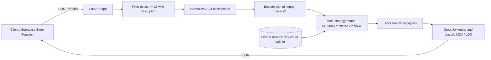

<div align="center">

# FortiFund ML Lender Detection Service


**A FastAPI service that detects Merchant Cash Advance (MCA) lender payments in bank transaction data using sentence-transformer embeddings, keyword, and fuzzy matching.**

<!-- TODO: screenshot/GIF - capture a sample /predict request and JSON response, e.g. via the Swagger UI at /docs -->

</div>

> [!NOTE]
> This is a working prototype (service version `2.3.2`). The detection logic combines a transformer model with keyword and fuzzy rules. Accuracy numbers are not measured in this repository, so treat the matching as heuristic rather than guaranteed.

## Table of Contents

- [About](#about)
- [Features](#features)
- [Tech Stack](#tech-stack)
- [Getting Started](#getting-started)
- [Usage](#usage)
- [API Reference](#api-reference)
- [Architecture](#architecture)
- [Project Structure](#project-structure)
- [Configuration](#configuration)
- [Roadmap](#roadmap)
- [Contributing](#contributing)
- [License](#license)

## About

This service reads a list of bank transactions and finds recurring payments that look like Merchant Cash Advance (MCA) or Line of Credit (LOC) repayments to known funding companies. It was built to run behind a Supabase Edge Function (CORS is open by default), but it is a plain HTTP API and can be called from anything.

For each transaction it filters debits of at least `$25` that carry a description, cleans up noisy ACH text (for example `Orig CO Name:Fundbox Inc. Orig ID:Fbxinc...`), and then scores the cleaned text against a list of known lenders. Matching uses three signals at once: semantic similarity from the `all-mpnet-base-v2` sentence-transformer, exact keyword presence, and fuzzy string ratio. A validation step blocks known non-MCA payees (tax agencies, utilities, payroll providers, and similar) to cut false positives.

The lender list can come from the request itself (a database-driven `known_lenders` field) or fall back to a built-in dictionary of 17 lenders and their aliases. Transactions that match no known lender can still be grouped into "unknown" positions when the same cleaned name repeats often enough.

## Features

- MCA and LOC lender detection from raw bank transaction lists.
- ACH description preprocessing that extracts a clean company name from noisy text.
- Multi-strategy matching: semantic embeddings plus keyword plus fuzzy ratio.
- Non-MCA payee filtering to reduce false positives (tax, government, utilities, payroll, gig apps).
- Database-driven lenders via the request body, or a built-in list of 17 lenders as fallback.
- Product type guess (MCA vs LOC) and payment frequency label from transaction spacing.
- Daily payment obligation estimate across active positions.
- Built-in debug endpoint that returns per-transaction match scores.
- Open CORS so it can be called from Supabase Edge Functions or a browser.

## Tech Stack

| Layer | Technology |
|-------|------------|
| Language | Python 3.11 |
| Web framework | FastAPI |
| ASGI server | Uvicorn |
| Embeddings | sentence-transformers (`all-mpnet-base-v2`) |
| ML runtime | PyTorch |
| Similarity / utils | scikit-learn (cosine similarity), pandas, difflib |
| Validation | Pydantic |
| Deploy target | Render (see `render.yaml`) |

## Getting Started

### Prerequisites

```bash
python --version   # 3.11 or newer
pip --version
```

### Installation

```bash
git clone https://github.com/atiqbitstream/ml_service.git
cd ml_service

python -m venv venv
# Linux / macOS
source venv/bin/activate
# Windows
venv\Scripts\activate

pip install -r requirements.txt
```

### Run

```bash
uvicorn app:app --reload --host 0.0.0.0 --port 8000
```

The first start downloads the `all-mpnet-base-v2` model (around 420 MB), so give it a moment. Once it prints `Model loaded successfully!`, the API is live on port `8000`. Interactive docs are at `http://localhost:8000/docs`.

## Usage

A sample request body ships in `test_sample.json`. Send it to `/predict`:

```bash
curl -X POST http://localhost:8000/predict \
  -H "Content-Type: application/json" \
  -d @test_sample.json
```

Each transaction needs `date` (`YYYY-MM-DD`), `description`, `amount`, and `type` (`debit` or `credit`). Only debits of at least `$25` with a description are analyzed. Example response shape:

```json
{
  "detected_lenders": [
    {
      "lender_name": "OnDeck",
      "confidence": 0.873,
      "status": "Active",
      "first_seen": "2024-01-01",
      "last_seen": "2024-01-04",
      "transaction_count": 4,
      "average_amount": 496.38,
      "total_amount": 1985.5,
      "frequency": "Daily/Weekly",
      "product_type": "MCA",
      "product_confidence": 0.8,
      "chronological_transactions": []
    }
  ],
  "summary": {
    "total_positions": 1,
    "active_positions": 0,
    "total_daily_obligation": 0.0,
    "transactions_analyzed": 14,
    "debit_transactions": 12
  },
  "model_info": {
    "model_name": "all-mpnet-base-v2-optimized",
    "confidence_threshold": 0.5,
    "min_transactions_for_position": 4
  }
}
```

`status` is `Active` only when the latest matched transaction is within the last 90 days, so older sample data will show `Past`.

To use your own lender list, add a `known_lenders` array to the request:

```json
{
  "transactions": [ { "date": "2024-01-01", "description": "ACME CAP", "amount": 300, "type": "debit" } ],
  "known_lenders": [
    { "lender_name": "Acme Capital", "aliases": ["acme cap", "acme"], "product_types": ["MCA"] }
  ]
}
```

## API Reference

| Method | Path | Description |
|--------|------|-------------|
| `GET` | `/` | Service info, version, and endpoint list. |
| `GET` | `/health` | Health check: model loaded, lender and alias counts. |
| `GET` | `/lenders` | The built-in lender dictionary with all aliases. |
| `POST` | `/predict` | Detect lenders. Query params: `confidence_threshold` (default `0.50`), `min_transactions` (default `4`). |
| `POST` | `/debug-predict` | Per-transaction match scores for the top 10 lenders. |

## Architecture



## Project Structure

```text
ml_service/
├── app.py              # FastAPI app: endpoints, matching logic, lender data
├── requirements.txt    # Python dependencies
├── runtime.txt         # Python version pin for Render
├── render.yaml         # Render web service config
├── test_sample.json    # Example /predict request body
├── .env.example        # Example environment variables
└── README.md
```

## Configuration

The app does not require environment variables to run locally. The variables below apply to deployment (see `.env.example` and `render.yaml`).

| Variable | Description | Default |
|----------|-------------|---------|
| `PORT` | Port the Uvicorn server binds to | `8000` |
| `PYTHON_VERSION` | Python version for the deploy platform | `3.11.0` |

Detection behavior is tuned through query parameters on `/predict` rather than env vars: `confidence_threshold` (default `0.50`) and `min_transactions` (default `4`).

## Roadmap

- [ ] Add an automated test suite and measured accuracy figures.
- [ ] Persist detected positions instead of computing per request.
- [ ] Make the built-in lender list and thresholds configurable without code edits.
- [ ] Add authentication for production deployments.
- [ ] Containerize with a Dockerfile for portable deploys.

## Contributing

Contributions are welcome. Open an issue to discuss a change, then send a pull request.

## License

Distributed under the MIT License. See [LICENSE](LICENSE).
